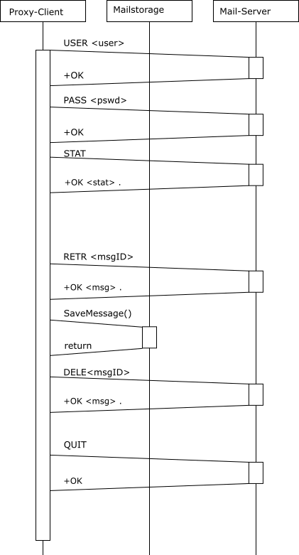
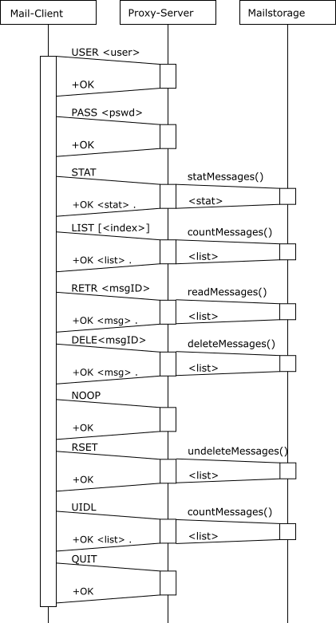

# Dokumentation POP3-Proxy

## Config Layout
Es gibt eine Configurationsdatei für bei Applikationen zusammen, welche sich im Hauptverzeichnis befindet (config.ini).

Diese hat folgendes Layout:

```ini
[<wanted_username>]
username=<username_for_orig_server>
password=<password_for_orig_server>
host=<hostname/ip_of_orig_server>
port=<port_of_orig_server>
maildir=<dir_for_mails>
```

| Param | Beschreibung |
|-------|--------------|
| wanted_username | Der Benutzername, für die Verbindung auf den Proxy |
| username | Der Benutzername, des Kontos |
| password | Das dazugehörige Passwort |
| host | Host oder IP des eigentlichen POP3 Servers |
| port | Port des eigentlichen POP3 Servers |
| maildir | Relatives Verzeichnis zum speichern der Nachrichten dieses Kontos |

Diese Gruppe kann beliebig of wiederholt werden um alle benötigten Kontos zu benutzen.

---

## Maildir Layout
Da jeder Benutzer sein eigenes Maildir besitzt, können die Mails direkt in das Verzeichnis gespeichert werden. Jede Mail hat als Namen eine UUID die vom Proxy beim laden der Mail generiert wird.

---

## Run parameter

### Client
-- NONE --
### Server
| Param | Beschreibung |
|-------|--------------|
| -p    | Port des Servers |
| -n    | Maximale Clientanzahl |


## Sequenz Layout



